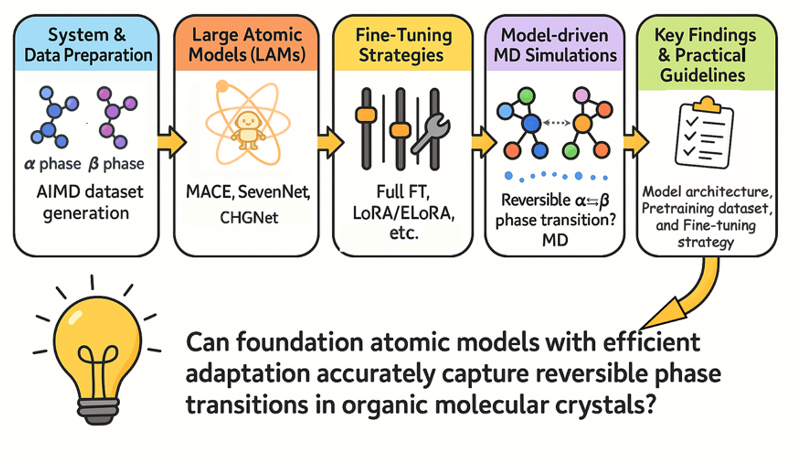

# FAMs-for-polymorphic-transformations Project

## **Paper Title**:<br>***Efficient fine-tuning of foundation atomistic models for reversible polymorphic phase transitions in organic molecular crystals*** [https://chemrxiv.org/engage/chemrxiv/article-details/688c5c5823be8e43d638c3b1] <br> 


Lightweight repository implementing **ELoRA** for equivariant GNNs and **LoRA** for invariant GNNs.  
This codebase demonstrates fine-tuning foundation models (MACE, SevenNet, CHGNet) with low-rank adapters.

 **MACE** support is built on the *e3nn* ecosystem and the MACE framework.   <br>
 **SevenNet** support is built on the *e3nn* ecosystem and the SevenNet framework.  <br> 
 **CHGNet** support uses PEFT-style adapters and CHGNet framework. 

---

## Data sample (.extxyz format)

Below is a single-frame `.extxyz` example (kept from your original file). Use this as a template:

```text
36
Properties=species:S:1:pos:R:3:forces:R:3 REF_energy=-203.18678317 Lattice="7.75640000 0.00000000 0.00000000 -0.11045220 10.71853092 0.00000000 -0.17760577 -3.80304806 11.13449525"
H       7.36468000     10.21931000      1.09007000      0.07810700     -0.01555800      0.12200500
H       5.27654000      0.36900000      9.10546000      0.10059300      0.06820700      0.00643600
H       1.00107000      3.26021000      4.16508000      0.12019200      0.00215600     -0.14753200
H       0.57354000      1.31696000      1.32500000     -0.03847200      0.10923100      0.02317900
C       6.99806000      8.14418000      1.06346000     -0.13473700     -0.72076100      0.06783300
C      -0.21445000      3.99668000     10.20131000      0.02525000      0.18346500     -0.51738800
C      -0.03657000      5.35757000     10.44371000      0.72062900      0.25167600     -0.72249500
C       3.99719000     -1.31503000      9.29229000     -0.24984500     -0.63551900      0.15232500
C       2.50223000     -0.63385000      7.89547000     -0.20191000      0.33941200     -0.26274600
C       3.48656000      0.35364000      7.94068000     -0.36870200      0.59692900     -0.76930200
C       6.69132000      3.04657000      4.62048000     -0.75425100     -0.15612700      0.08688600
C       6.46863000      4.95313000      5.59943000      0.12688000      0.18069400      0.04985400
C       0.03352000      4.87776000      5.15794000      0.32095300      0.81993100      0.32503900
C       2.47879000      1.15081000      2.28313000      0.77072200     -0.06172900      0.36974800
C       3.02626000      3.20929000      2.02080000      0.07387000      0.24219500     -0.07278900
C       1.75637000      3.07488000      1.47131000     -0.32414600      1.02384500     -0.15222600
N       7.15880000      7.17213000      0.15020000     -0.24720500      0.70673700      0.71204800
N       7.43450000      9.34125000      0.59391000     -0.21912800     -0.17708500     -0.00458300
N       2.82445000     -1.66419000      8.73891000      0.77405400      0.12378700      0.37069100
N       4.42662000     -0.11212000      8.82921000     -0.03666800     -0.22484500      0.19939800
N       5.78800000      3.81366000      5.25481000      0.64077100     -0.42168200     -0.43371800
N       0.14718000      3.65579000      4.54054000     -0.17635900     -0.08744200      0.10072800
N       3.47133000      2.01643000      2.51662000     -0.82111500     -0.51866500     -0.10758400
N       1.42183000      1.75289000      1.66138000      0.22078100     -0.19384700      0.07633800
I       1.11940000      6.90732000      9.51431000     -0.46045300     -0.52713700      0.32542400
I       0.16961000      2.92258000      8.44551000      0.03033800      0.18793700      0.31335300
I       6.35959000      7.92673000      3.03693000     -0.01764800     -0.05214700     -0.18850100
I       3.89649000      2.10576000      6.82957000     -0.12300000     -0.62491900      0.34683700
I       0.74038000     -0.68223000      6.75329000      0.34737300      0.19800800      0.19702800
I       5.10797000     -2.47649000     10.62476000     -0.27355600      0.16699000     -0.30137000
I       1.71304000      6.12267000      5.33821000     -0.47466400     -0.37443300      0.01397400
I       5.54943000      6.47658000      6.71655000      0.26608500     -0.21452500     -0.31163700
I       6.33749000      1.15795000      3.79864000      0.20319500      0.07227700      0.29907800
I       0.45081000      4.59783000      0.78921000      0.40614000     -0.46546000      0.10025600
I       4.23892000      4.90632000      2.09340000     -0.18968900     -0.01057700     -0.11252300
I       2.59642000     -0.85314000      2.85555000     -0.11438500      0.20898100     -0.15406500
```

Our dataset was submitted to Figshare alongside the paper.

---

## Install ELoRA_MACE environment

**Requirements:**

- Python >= 3.7
- [PyTorch](https://pytorch.org/) >= 1.12 **(training with float64 is not supported with PyTorch 2.1 but is supported with 2.2 and later.)**.

(for openMM, use Python = 3.9)

To install from source using `conda`, follow the steps below:

```sh
# Create a virtual environment and activate it
conda create --name ELoRA_mace_env
conda activate ELoRA_mace_env

# Install PyTorch
conda install pytorch torchvision torchaudio pytorch-cuda=11.6 -c pytorch -c nvidia

# (optional) Install MACE's dependencies from Conda as well
conda install numpy scipy matplotlib ase opt_einsum prettytable pandas e3nn

# Clone and install MACE (and all required packages)
git clone https://github.com/pic-ai-robotic-chemistry/FAMs-for-polymorphic-transformations.git
cd ELoRA-MACE_ELoRA
pip install ./
```

---

## ELoRA for fine-tuning foundation models of MACE

Example mace_run_train invocation for fine-tuning a MACE foundation model using ELoRA. Flags below are the example you provided; adjust file paths and hyperparameters for your dataset.\
```bash
mace_run_train \
    --name="MACE_model" \
    --train_file="./dataset/train.xyz" \
    --valid_fraction=0.1 \
    --test_file="./dataset/test.xyz" \
    --E0s='average' \
    --foundation_model="MACE-OFF23_medium.model" \
    --model="MACE" \
    --loss="ef" \
    --num_interactions=2 \
    --num_channels=128 \
    --max_L=1 \
    --correlation=3 \
    --r_max=5.0 \
    --lr=0.005 \
    --forces_weight=1000 \
    --energy_weight=1 \
    --weight_decay=1e-8 \
    --clip_grad=100 \
    --batch_size=5 \
    --valid_batch_size=5 \
    --max_num_epochs=500 \
    --scheduler_patience=5 \
    --ema \
    --ema_decay=0.995 \
    --error_table="TotalRMSE" \
    --default_dtype="float64"\
    --device=cuda \
    --seed=123 \
    --save_cpu
```

---

## Install ELoRA_SevenNet environment

### Requirements
- Python >= 3.8
- PyTorch >= 2.0.0, PyTorch =< 2.5.2
- [Optional] cuEquivariance >= 0.4.0

For CUDA version, refer to PyTorch's compatibility matrix: https://github.com/pytorch/pytorch/blob/main/RELEASE.md#release-compatibility-matrix

```bash
# Create a virtual environment and activate it
conda create --name ELoRA_SevenNet_env
conda activate ELoRA_SevenNet_env

git clone https://github.com/pic-ai-robotic-chemistry/FAMs-for-polymorphic-transformations.git
cd EloRA-SevenNet_ELoRA
pip install ./
```

---

## ELoRA for fine-tuning foundation models of SevenNet

Run the CLI train_sevenn.py (example script provided in this repo) to fine-tune SevenNet. Example:

```bash
python train_sevenn.py \
       --pretrained 7net-0 \
       --xyz xyz_files/atoms_7774.xyz \
       --device cuda:0 \
       --energy-weight 1.0 \
       --force-weight 25.0 \
       --stress-weight 0.01 \
       --epochs 100 \
       --batch-size 20 \
       --lr 0.004 \
       --train-rescale \
       --out ./checkpoints/Elora_sevennet.pth
```

---

## LoRA for fine-tuning foundation models of CHGNet

Please read the readme in the LoRA-CHGNet directory.

---

## Requirment for running Molecular dynamics simulation

```text
numpy, ase, pymatgen, calculator(MACE, CHGNet, SevenNet), argparse
```

---

## Molecular dynamics simulation of phase change

```sh
python run_npt.py \
  --file_path path/to/structure.cif \
  --model path/to/mace_model \
  --device cpu \
  --mode increase \ #increase or decrease pressure
  --total_time_fs 3000000 \
  --ramp_time_fs 2000000 \
  --xyz_filename out.xyz \
  --log_filename out.log \
  --traj_filename out.traj
```

